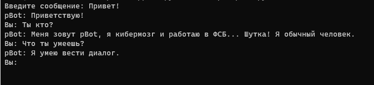

# pBotWrapper
Оболочка для отправки и приема сообщений от p-bot (http://p-bot.ru/). Реализована генерация csrf токена осуществляемая на клиенте.

## Протестировать
```bash
git clone https://github.com/x0152/pBotWrapper
cd pBotWrapper
python3 example_pBot.py
```

## Пример использования
```python
import pBot

pbot = pBot.pBot("<Твое имя>")
pbot.Init()

msg = input("Введи сообщение: ")
while msg != "exit":
    print("pBot: {0}".format(pbot.Ask(msg)))
    msg = input("Вы: ")
```

</img>
## Траблшутинг
### Ошибка 502 Bad Gateway
<p>Для корректной работы необхоимо, чтобы время клиента совпадало с временем сервера.</p>
<p><b>Решение: Установить таймзону Europe/Moscow: </b></p>
<p><code>sudo timedatectl set-timezone Europe/Moscow</code></p>
